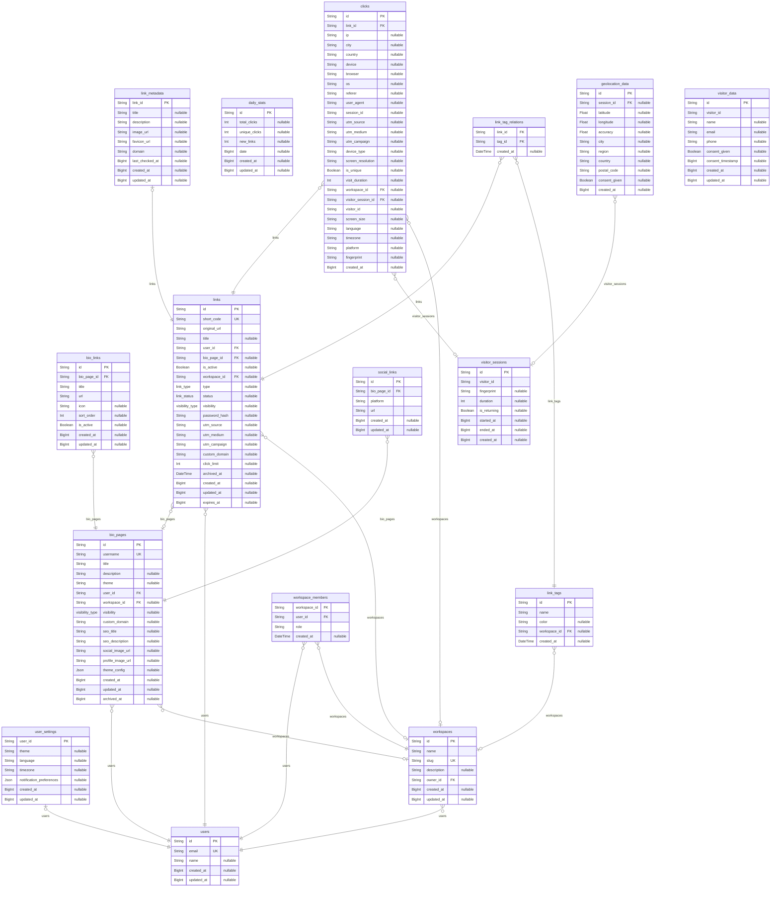

# Bio Shortlink
> Generated by [`prisma-markdown`](https://github.com/samchon/prisma-markdown)

- [default](#default)

## default

### `bio_links`
This model contains row level security and requires additional setup for migrations. Visit https://pris.ly/d/row-level-security for more info.

**Properties**
  - `id`: 
  - `bio_page_id`: 
  - `title`: 
  - `url`: 
  - `icon`: 
  - `sort_order`: 
  - `is_active`: 
  - `created_at`: 
  - `updated_at`: 

### `bio_pages`
This model contains row level security and requires additional setup for migrations. Visit https://pris.ly/d/row-level-security for more info.

**Properties**
  - `id`: 
  - `username`: 
  - `title`: 
  - `description`: 
  - `theme`: 
  - `user_id`: 
  - `workspace_id`: 
  - `visibility`: 
  - `custom_domain`: 
  - `seo_title`: 
  - `seo_description`: 
  - `social_image_url`: 
  - `profile_image_url`: 
  - `theme_config`: 
  - `created_at`: 
  - `updated_at`: 
  - `archived_at`: 

### `clicks`
This model contains row level security and requires additional setup for migrations. Visit https://pris.ly/d/row-level-security for more info.

**Properties**
  - `id`: 
  - `link_id`: 
  - `ip`: 
  - `city`: 
  - `country`: 
  - `device`: 
  - `browser`: 
  - `os`: 
  - `referer`: 
  - `user_agent`: 
  - `session_id`: 
  - `utm_source`: 
  - `utm_medium`: 
  - `utm_campaign`: 
  - `device_type`: 
  - `screen_resolution`: 
  - `is_unique`: 
  - `visit_duration`: 
  - `workspace_id`: 
  - `visitor_session_id`: 
  - `visitor_id`: 
  - `screen_size`: 
  - `language`: 
  - `timezone`: 
  - `platform`: 
  - `fingerprint`: 
  - `created_at`: 

### `daily_stats`
This model contains row level security and requires additional setup for migrations. Visit https://pris.ly/d/row-level-security for more info.

**Properties**
  - `id`: 
  - `total_clicks`: 
  - `unique_clicks`: 
  - `new_links`: 
  - `date`: 
  - `created_at`: 
  - `updated_at`: 

### `link_metadata`
This model contains row level security and requires additional setup for migrations. Visit https://pris.ly/d/row-level-security for more info.

**Properties**
  - `link_id`: 
  - `title`: 
  - `description`: 
  - `image_url`: 
  - `favicon_url`: 
  - `domain`: 
  - `last_checked_at`: 
  - `created_at`: 
  - `updated_at`: 

### `link_tag_relations`
This model contains row level security and requires additional setup for migrations. Visit https://pris.ly/d/row-level-security for more info.

**Properties**
  - `link_id`: 
  - `tag_id`: 
  - `created_at`: 

### `link_tags`
This model contains row level security and requires additional setup for migrations. Visit https://pris.ly/d/row-level-security for more info.

**Properties**
  - `id`: 
  - `name`: 
  - `color`: 
  - `workspace_id`: 
  - `created_at`: 

### `links`
This model contains row level security and requires additional setup for migrations. Visit https://pris.ly/d/row-level-security for more info.

**Properties**
  - `id`: 
  - `short_code`: 
  - `original_url`: 
  - `title`: 
  - `user_id`: 
  - `bio_page_id`: 
  - `is_active`: 
  - `workspace_id`: 
  - `type`: 
  - `status`: 
  - `visibility`: 
  - `password_hash`: 
  - `utm_source`: 
  - `utm_medium`: 
  - `utm_campaign`: 
  - `custom_domain`: 
  - `click_limit`: 
  - `archived_at`: 
  - `created_at`: 
  - `updated_at`: 
  - `expires_at`: 

### `social_links`
This model contains row level security and requires additional setup for migrations. Visit https://pris.ly/d/row-level-security for more info.

**Properties**
  - `id`: 
  - `bio_page_id`: 
  - `platform`: 
  - `url`: 
  - `created_at`: 
  - `updated_at`: 

### `user_settings`
This model contains row level security and requires additional setup for migrations. Visit https://pris.ly/d/row-level-security for more info.

**Properties**
  - `user_id`: 
  - `theme`: 
  - `language`: 
  - `timezone`: 
  - `notification_preferences`: 
  - `created_at`: 
  - `updated_at`: 

### `users`
This model contains row level security and requires additional setup for migrations. Visit https://pris.ly/d/row-level-security for more info.

**Properties**
  - `id`: 
  - `email`: 
  - `name`: 
  - `created_at`: 
  - `updated_at`: 

### `workspace_members`
This model contains row level security and requires additional setup for migrations. Visit https://pris.ly/d/row-level-security for more info.

**Properties**
  - `workspace_id`: 
  - `user_id`: 
  - `role`: 
  - `created_at`: 

### `workspaces`
This model contains row level security and requires additional setup for migrations. Visit https://pris.ly/d/row-level-security for more info.

**Properties**
  - `id`: 
  - `name`: 
  - `slug`: 
  - `description`: 
  - `owner_id`: 
  - `created_at`: 
  - `updated_at`: 

### `geolocation_data`
This model contains row level security and requires additional setup for migrations. Visit https://pris.ly/d/row-level-security for more info.

**Properties**
  - `id`: 
  - `session_id`: 
  - `latitude`: 
  - `longitude`: 
  - `accuracy`: 
  - `city`: 
  - `region`: 
  - `country`: 
  - `postal_code`: 
  - `consent_given`: 
  - `created_at`: 

### `visitor_data`
This model contains row level security and requires additional setup for migrations. Visit https://pris.ly/d/row-level-security for more info.

**Properties**
  - `id`: 
  - `visitor_id`: 
  - `name`: 
  - `email`: 
  - `phone`: 
  - `consent_given`: 
  - `consent_timestamp`: 
  - `created_at`: 
  - `updated_at`: 

### `visitor_sessions`
This model contains row level security and requires additional setup for migrations. Visit https://pris.ly/d/row-level-security for more info.

**Properties**
  - `id`: 
  - `visitor_id`: 
  - `fingerprint`: 
  - `duration`: 
  - `is_returning`: 
  - `started_at`: 
  - `ended_at`: 
  - `created_at`: 